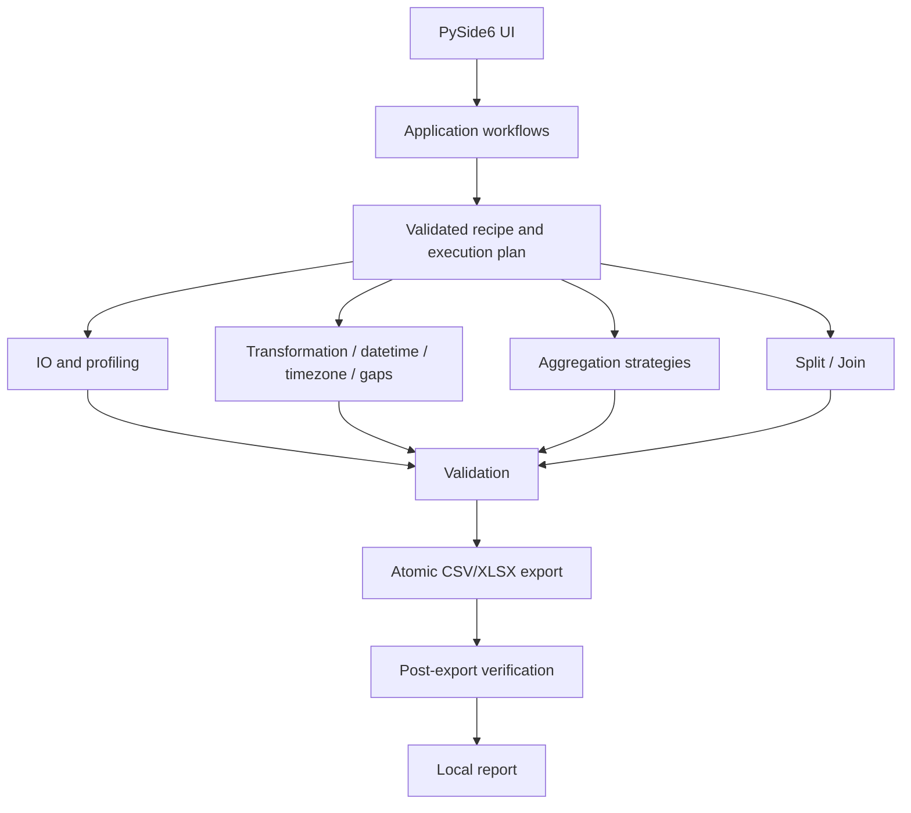

# Architecture and development

## Summary

GDTT uses Python 3.13 and PySide6/Qt Widgets. UI code presents and edits configuration; business modules own calculations. Production processing uses bounded-memory batches and private disk-backed spill storage.

## Architecture



This is a responsibility map, not a claim that every workflow uses an identical recipe schema. Split / Join has its own configuration and reuses established readers/writers/verification.

## Find the right module

| Responsibility | Under `src/data_transform_tool/` |
| --- | --- |
| Windows, views, controls, models and workers | `ui/` |
| Workflow composition and startup | `app/` |
| Immutable tables, batch contracts and spill storage | `domain/` |
| Inspection and readers | `io/` |
| Column operations and recipes | `transformation/` |
| Formats, timestamp roles and zones | `datetime/`, `timezone/` |
| Missing-row generation and validation | `gaps/`, `validation/` |
| Periods, completeness and statistics | `aggregation/` |
| Field/time splitting and joining | `split_join/` |
| Writers, naming and reopening checks | `export/` |
| Reports, logging, settings and templates | `reporting/`, `settings/`, `templates/` |

The immutable in-memory table remains a semantic reference for tests/previews. Production Reformat/Averaging use private SQLite-backed replayable batches; CSV-family inputs use standard-library readers, XLSX uses openpyxl read-only access and XlsxWriter creates workbooks.

Polars, PyArrow and DuckDB are optional benchmark/optimization candidates, not claims that current production correctness requires those engines.

## Run from source

Install Git and [uv](https://docs.astral.sh/uv/), then:

```powershell
git clone https://github.com/GGadash/GDTT.git
cd GDTT
uv sync --locked --extra dev
uv run gdtt
```

The compatibility command `uv run data-transform-tool` also works. Dependency installation can require internet access; dataset processing is local. `pyproject.toml` and `uv.lock` are the dependency source of truth.

## Verify a change

```powershell
uv run ruff format --check .
uv run ruff check .
uv run mypy
uv run pytest
uv run python scripts/audit_release_tree.py
```

Use focused tests while developing, then run relevant regression gates. Review [AGENTS.md](https://github.com/GGadash/GDTT/blob/main/AGENTS.md), current handoff notes and requirements. Keep calculations out of UI signal handlers; preserve recipe schemas, canonical nulls and timestamp semantics. Use synthetic fixtures, never operational data.

## Builds and documentation

On Windows, `./scripts/build_release_candidate.ps1` runs the complete local candidate pipeline. Binaries are unsigned until a signing identity is selected. Only an explicitly pushed release tag publishes assets through GitHub Actions; a documentation push does not rebuild or replace existing releases.

Wiki source is [About-Info/Wiki](https://github.com/GGadash/GDTT/tree/main/About-Info/Wiki). Follow [wiki maintenance](https://github.com/GGadash/GDTT/blob/main/About-Info/Human-Docs/WIKI_MAINTENANCE.md) to update both repositories without overwriting unreviewed web edits. No force-push or automatic historical tag replacement is part of normal maintenance.

Sources: [Architecture](https://github.com/GGadash/GDTT/blob/main/About-Info/Architecture/ARCHITECTURE.md) · [Module map](https://github.com/GGadash/GDTT/blob/main/About-Info/Architecture/MODULE_MAP.md) · [Editable diagrams](https://github.com/GGadash/GDTT/tree/main/About-Info/Diagrams).
