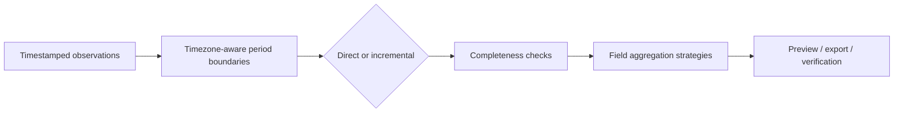

# Averaging and completeness

## Summary

Average / Aggregate calculates explicit statistics over timezone-aware periods. Confirm the timestamp, interval, missing markers and field statistic. Completeness is based on expected observations, not merely on the number of rows present.

## Configure a job

1. Choose **Average / Aggregate**, select one file or a compatible batch, and inspect.
2. Open **Configure averaging**.
3. Confirm the timestamp/parser, source timezone, reporting-boundary timezone and input interval.
4. Review source missing-marker choices and select **Marker decisions reviewed**.
5. Review selected fields, statistics and output names. Confirm or override suggestions.
6. Choose Direct or Incremental, configure periods and thresholds, and review previews/completeness.
7. Select **Review averaging plan**, inspect full-file results, export and verify.

## Direct versus Incremental

**Direct** calculates one target stage from source observations. **Incremental** runs an explicit chain of two or more stages and retains intermediate tables and completeness evidence. The two approaches need not give identical results after intermediate rejection or weighting; choose the method required by your protocol.

## Periods and boundaries

Options include common/custom clock intervals, day, week, calendar month, anchored fixed 30 days, quarter, custom season, reporting year and anchored fixed year. Calendar and fixed-length periods are not interchangeable.

Set reporting timezone and relevant day/week/month/season/year starts explicitly. DST can make a local day contain 23 or 25 elapsed hourly slots. Incompatible source intervals and period chains block instead of silently dropping or reweighting data.

## Completeness

The default threshold is **75%**. Expected counts derive from confirmed intervals and exact period boundaries. Valid/expected counts, availability, accepted/missing state and per-stage results remain visible.

The optional **2-of-3** exception applies only to an explicitly configured Incremental stage with exactly three expected components. It is not a general alternative to the threshold. Rejected field-period results stay missing.

## Statistics

Arithmetic mean is the default. Other strategies include minimum, maximum, sum, median, population standard deviation and count. Leq uses an energy average, not an arithmetic average of dB; optional positive durations enable duration weighting. Rainfall accumulation and rain-rate mean are distinct choices.

Field names may suggest Leq or rainfall behavior, but a name is not proof of unit or meaning. Review units and the applicable measurement protocol yourself.

Sources: [User guide](https://github.com/GGadash/GDTT/blob/main/About-Info/Human-Docs/USER_GUIDE.md) · [Averaging design](https://github.com/GGadash/GDTT/blob/main/About-Info/Data-Processing/AVERAGING_DESIGN.md).
