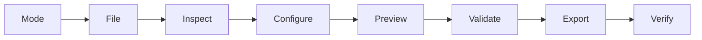

# GDTT documentation

## In brief

**GDTT — Data Transform Tool by Gadash (Akila DJ)** is a local Windows desktop app for data forging, transformations and aggregation, mainly for air-quality and other environmental time-series data. It reads CSV, TSV, delimited TXT and XLSX, lets you review explicit rules, and verifies exported CSV/Excel files.

**Current documented release: [v0.10.1-rc.1](https://github.com/GGadash/GDTT/releases/tag/v0.10.1-rc.1).** It is an **unsigned pre-release**. Automated Windows/Linux checks and local C-lite isolation passed; separate hands-on clean-Windows acceptance and actual monitor-scaling review remain pending. Read [Release status and safety](https://github.com/GGadash/GDTT/wiki/Release-Status-and-Safety) before use. Passing checks is not a guarantee of correctness for every dataset.

[Download and start](https://github.com/GGadash/GDTT/wiki/Getting-Started) · [Report a problem](https://github.com/GGadash/GDTT/issues) · [Source repository](https://github.com/GGadash/GDTT)

## Choose a workflow

| Your task | Guide |
| --- | --- |
| Select/rename/reorder fields, convert formats, adjust timezones or regularize a sampling grid | [Reformat and batch processing](https://github.com/GGadash/GDTT/wiki/Reformat-and-Batch) |
| Calculate statistics over periods with explicit completeness rules | [Averaging and completeness](https://github.com/GGadash/GDTT/wiki/Averaging-and-Completeness) |
| Split by fields or calendar periods; combine files or join parameters by timestamp | [Splitting and joining](https://github.com/GGadash/GDTT/wiki/Splitting-and-Joining) |

AQI generation and Reshape/Pivot are not implemented. A specification proposal or historical phase note is not proof that a feature is available.

## How the normal workflow works

Detection provides suggestions, not permission to change the data. Review timestamp meaning, source timezone, missing markers and sampling interval. A bounded preview is not the full exported dataset; full-file execution and reopening verification occur later.

## Read in detail

1. [Getting started](https://github.com/GGadash/GDTT/wiki/Getting-Started): portable versus installer, downloads and first run.
2. [Reformat and batch](https://github.com/GGadash/GDTT/wiki/Reformat-and-Batch): inspection, field mapping and compatible files.
3. [Formats and timezones](https://github.com/GGadash/GDTT/wiki/Formats-and-Timezones): ISO, Custom, decimals and UTC.
4. [Gaps and missing values](https://github.com/GGadash/GDTT/wiki/Gaps-and-Missing-Values): optional gap rows, nulls and sentinels.
5. [Averaging and completeness](https://github.com/GGadash/GDTT/wiki/Averaging-and-Completeness): Direct/Incremental, periods and statistics.
6. [Splitting and joining](https://github.com/GGadash/GDTT/wiki/Splitting-and-Joining): parameters, exact-time joins and calendar splits.
7. [Export and verification](https://github.com/GGadash/GDTT/wiki/Export-and-Verification): filenames, reports, templates and result checks.
8. [Files and folders](https://github.com/GGadash/GDTT/wiki/Files-and-Folders): user data, logs, source tree and generated builds.
9. [Appearance and accessibility](https://github.com/GGadash/GDTT/wiki/Appearance-and-Accessibility): themes, font sizes and resizing.
10. [Architecture and development](https://github.com/GGadash/GDTT/wiki/Architecture-and-Development): modules, diagrams and repeatable checks.
11. [Release status and safety](https://github.com/GGadash/GDTT/wiki/Release-Status-and-Safety): tested evidence, limitations and acceptance checklist.
12. [Troubleshooting and FAQ](https://github.com/GGadash/GDTT/wiki/Troubleshooting-and-FAQ): common decisions and safe bug reports.
13. [License, credits and support](https://github.com/GGadash/GDTT/wiki/License-Credits-and-Support): copyright, OpenAI Codex, libraries and support.

## Documentation scope

Reviewed 2026-09-16 against app 0.10.1 and its published RC1. This wiki is a curated user guide, not a replacement for the [original specification](https://github.com/GGadash/GDTT/blob/main/DATA%20TRANSFORM%20TOOL%20STUDIO.md), [changelog](https://github.com/GGadash/GDTT/blob/main/CHANGELOG.md), [versioned documentation map](https://github.com/GGadash/GDTT/blob/main/About-Info/README.md), or actual release evidence. Historical documents may describe older phases; prefer this guide and the current release notes for availability.
